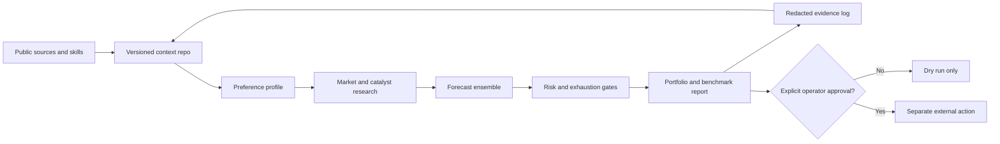

# AI Hedge Fund Plus System

Personal, public implementation of an Atlan-inspired context layer for a customized AI-assisted investment research workflow.

This repository is the system: context conventions, public tool links, optional forecasting components, research gates, prompts for replication, benchmark rules, evidence methods, and a change-log format. It is intentionally personal in purpose while remaining reproducible for another operator.

## What this is

The project combines public Agent Skills patterns, context-layer ideas, Kronos forecast evidence, broad-market research, catalyst-first security review, momentum-exhaustion checks, macro risk haircuts, portfolio constraints, and scheduled report operations. The combination and operating rules are Jeremy's personal design.

It uses the local `atlan-scale` name for the context-layer skill, but it is not an official vendor product or affiliated implementation. It is also not affiliated with any linked model, data, broker, or delivery provider.

This is an educational research system, not financial advice. It does not place trades, send email, or install software by itself. Any external action requires explicit operator configuration and confirmation.

## Personal purpose and success rule

The personal objective is to beat the S&P 500 over the defined experiment window while customizing sector, security, and cash weights. The design accepts approximately benchmark performance in strong markets, seeks higher highs and higher lows, and requires outperformance during material market weakness. If the portfolio cannot demonstrate meaningful net outperformance by the predeclared review date, the experiment should be judged unsuccessful and the operator should consider returning to the benchmark.

The default example uses SPY as an investable S&P 500 proxy, but replication prompts ask each operator to choose a benchmark, start date, risk budget, sector limits, schedule, and failure review date. No baseline is assumed.

## Current evidence snapshot

The public evidence is deliberately conservative:

- Archived observations currently run through 2026-08-05. The report text says the two-month trial began 2026-07-11, but an independently archived 2026-07-11 baseline is not present in the published evidence.
- The user-reported belief that the portfolio is about 3% ahead of the S&P is recorded as an unverified hypothesis, not a measured result.
- The latest archived checkpoint, 2026-08-05, shows a month spread of -1.14 percentage points versus SPY. That is evidence that the system was not consistently outperforming at that checkpoint.
- The evidence table contains redacted percentage returns only. It excludes account balances, order values, credentials, private emails, raw reports, and broker identifiers.

Read [the evidence methodology](docs/evidence-methodology.md), [the checkpoint table](evidence/weekly-checkpoints.csv), and [the progress narrative](evidence/progress.md) before drawing conclusions.

## Quick start

```bash
git clone https://github.com/engbyume/ai-hedge-fund-plus-system.git
cd ai-hedge-fund-plus-system
python3 scripts/validate_repo.py
```

Then use the prompts in this order:

1. [`00-bootstrap.md`](prompts/00-bootstrap.md) to establish a private runtime and source hierarchy.
2. [`01-install-and-verify.md`](prompts/01-install-and-verify.md) to inspect the host and install only compatible public tools.
3. [`02-configure-your-experiment.md`](prompts/02-configure-your-experiment.md) to collect benchmark, risk, portfolio, and schedule preferences.
4. [`03-daily-operator.md`](prompts/03-daily-operator.md) for a dry-run daily research cycle.
5. [`04-review-and-update.md`](prompts/04-review-and-update.md) for evidence-driven changes.
6. [`05-evidence-import.md`](prompts/05-evidence-import.md) to import redacted observations.

For a single long instruction, use [`replicate-the-system.md`](prompts/replicate-the-system.md).

## System map



The context repo is the control plane. It records source authority, operator preferences, decision rules, model versions, evidence, failed ideas, and changes. Private runtime state stays outside this repository.

## Public tools and references

See [`integrations/tools.md`](integrations/tools.md) for the complete link and license map. The core public references are:

- [Agent Skills](https://agentskills.io/), the open folder-based skill format.
- [Kronos](https://github.com/shiyu-coder/Kronos), the financial K-line forecast provider used by the private runtime when available.
- [The upstream AI Hedge Fund project](https://github.com/virattt/ai-hedge-fund), used as a public reference, not vendored.
- [yfinance](https://github.com/ranaroussi/yfinance), [SnapTrade](https://snaptrade.com/), and [AgentMail](https://agentmail.to/), the market-data, broker-readback, and delivery providers used by the private runtime when enabled.

## Research principles

- Ask what the operator is trying to beat before selecting weights or schedules.
- Treat a company-specific catalyst as necessary for an individual-stock thesis, not as decoration after a price move.
- Require a countercase, invalidation signal, platform-availability status, and source date.
- Measure momentum breadth, late-versus-early strength, and largest-up-day concentration. A single-day spike is exhaustion risk.
- Use macro and cross-market evidence as a risk haircut, not as a substitute for company research.
- Keep benchmark and portfolio measurement on the same dates, with cash flows and costs handled consistently.
- Never convert a watchlist comparison into a trade instruction without explicit availability and approval.
- Never publish or execute an unmatched sell. Every proposed sale must have a corresponding buy or a documented operator-approved hold of proceeds.

## Public and private boundary

Safe to publish: architecture, generic prompts, public links, schemas, redacted percentage evidence, decision rationale, tests, and change logs.

Keep private: API keys, `.env` files, broker or email account identifiers, account balances, exact order sizes, raw reports, raw email bodies, database files, cached market exports, cookies, and local home-directory paths. See [`docs/privacy-and-publication.md`](docs/privacy-and-publication.md).

## Repository map

| Path | Purpose |
| --- | --- |
| [`ARCHITECTURE.md`](ARCHITECTURE.md) | Components and trust boundaries |
| [`skills/atlan-scale/SKILL.md`](skills/atlan-scale/SKILL.md) | Portable Agent Skill entry point |
| [`prompts/`](prompts/) | Bootstrap, installation, preference intake, operation, review, and replication prompts |
| [`config/`](config/) | Non-personal configuration examples |
| [`evidence/`](evidence/) | Redacted progress, source register, and decision log |
| [`docs/`](docs/) | Reproduction, measurement, safety, and operating procedures |
| [`scripts/validate_repo.py`](scripts/validate_repo.py) | Dependency-free publication audit |

## License and attribution

Original documentation, prompts, schemas, and scripts in this repository are MIT licensed. Linked projects, model weights, datasets, and provider services retain their own licenses and terms. See [`THIRD_PARTY_NOTICES.md`](THIRD_PARTY_NOTICES.md).
